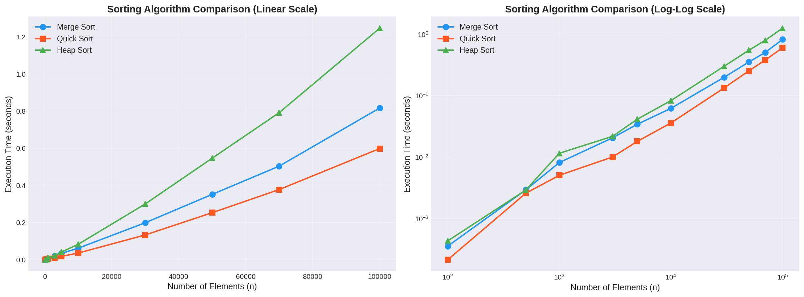

# Comparative Analysis of Sorting Algorithms in E-Commerce Data

> **DAA – Assignment 1**  
> Submission Date: 15 April 2026

---

## 1. Objective

Implement, analyze, and compare **Merge Sort**, **Quick Sort**, and **Heap Sort** using a realistic e-commerce dataset, and evaluate their performance under different conditions.

## 2. Problem Context

A national e-commerce platform needs to efficiently sort large volumes of product data for price comparison, product ranking, and fast search-result retrieval. This study benchmarks three `O(n log n)` sorting algorithms to determine which is best suited for each use case.

## 3. Dataset

Each product is a `(Product_ID, Price_in_ETB)` tuple:

| Product ID | Price (ETB) |
|:----------:|:-----------:|
| 101        | 250         |
| 102        | 120         |
| 103        | 450         |
| 104        | 300         |
| 105        | 200         |
| 106        | 150         |
| 107        | 500         |
| 108        | 320         |
| 109        | 280         |
| 110        | 100         |

**Expected sorted output (by price ascending):**  
`100, 120, 150, 200, 250, 280, 300, 320, 450, 500`

---

## 4. Algorithm Implementations (Tasks 1 & 2)

All three algorithms are implemented in [`sorting_algorithms.py`](sorting_algorithms.py) with both **tracing** (step-by-step output) and **non-tracing** (for timing) variants.

### 4.1 Merge Sort

**Approach:** Divide-and-conquer — recursively split the array into halves, sort each half, and merge the two sorted halves.

**Key steps traced:**
1. **Splitting** — the array is divided at the midpoint until subarrays have a single element (base case).
2. **Merging** — pairs of sorted subarrays are merged by comparing elements from left and right, producing a sorted result at each level.

**Implementation detail:** Uses the last element as no pivot — purely splits at the midpoint. The `merge()` helper performs a two-pointer walk over the left and right halves.

### 4.2 Quick Sort

**Approach:** Partition-based divide-and-conquer — select a pivot, partition elements into `≤ pivot` and `> pivot` groups, and recursively sort each partition.

**Key steps traced:**
1. **Pivot selection** — the last element of the current subarray is chosen as the pivot.
2. **Partitioning** — elements are separated into a left group (≤ pivot) and a right group (> pivot).
3. **Combining** — `sorted_left + [pivot] + sorted_right`.

**Implementation detail:** Uses a list-comprehension-based partition (not in-place), which makes the trace clearer but uses `O(n)` auxiliary space per recursion level.

### 4.3 Heap Sort

**Approach:** Selection-based — build a max-heap from the array, then repeatedly extract the maximum into the sorted portion.

**Key steps traced:**
1. **Build Max-Heap** — starting from the last non-leaf node, heapify downward to establish the heap property.
2. **Extract elements** — swap the root (maximum) with the last unsorted element, reduce the heap size by one, and re-heapify.

**Implementation detail:** Sorts in-place on a copy of the input. The `heapify()` function performs the sift-down operation.

---

## 5. Complexity Analysis (Task 3)

| Algorithm  | Best Case    | Average Case | Worst Case   | Space Complexity | Stable? |
|:-----------|:------------:|:------------:|:------------:|:----------------:|:-------:|
| Merge Sort | O(n log n)   | O(n log n)   | O(n log n)   | O(n)             | ✅ Yes  |
| Quick Sort | O(n log n)   | O(n log n)   | O(n²)        | O(log n)         | ❌ No   |
| Heap Sort  | O(n log n)   | O(n log n)   | O(n log n)   | O(1)             | ❌ No   |

### Key takeaways

- **Merge Sort** guarantees `O(n log n)` in all cases but requires `O(n)` extra memory for the temporary merge arrays.
- **Quick Sort** has the best *practical* performance on average due to excellent cache locality, but degrades to `O(n²)` when the pivot consistently partitions poorly (e.g., already-sorted input with last-element pivot).
- **Heap Sort** provides `O(n log n)` worst-case with only `O(1)` extra space, making it the most memory-efficient. However, its cache performance is typically worse than Quick Sort's due to non-sequential memory access patterns during heapify.

---

## 6. Experimental Evaluation & Graph Analysis (Task 4)

### 6.1 Experimental Setup

- **Input sizes tested:** 100 · 500 · 1,000 · 3,000 · 5,000 · 10,000 · 30,000 · 50,000 · 70,000 · 100,000
- **Data source:** Pre-generated CSV datasets in `synthetic_datasets/`, loaded through `manifest.json`
- **Data range:** Prices in ETB within `[10, 100000]`
- **Timing method:** `time.perf_counter()` averaged over 3 runs per size
- **Environment:** Python (CPython), single-threaded

### 6.1.1 Synthetic Data Generator

Use [`generate_synthetic_data.py`](generate_synthetic_data.py) to create the synthetic benchmark datasets currently configured by the project.
The script generates the following sizes: **100, 500, 1,000, 5,000, and 10,000**. These cover the smaller baseline runs used in Task 4.

The full experimental setup listed above also includes **50,000** and **100,000** input sizes. Those larger datasets are part of the Task 4 evaluation, but they are **not generated by the script in its current default configuration**.

```bash
python generate_synthetic_data.py
```

The generator now creates:

- `products_100.csv`
- `products_500.csv`
- `products_1000.csv`
- `products_3000.csv`
- `products_5000.csv`
- `products_10000.csv`
- `products_30000.csv`
- `products_50000.csv`
- `products_70000.csv`
- `products_100000.csv`

### 6.2 Performance Graph



The figure presents two views of the same benchmark data:

| View | Purpose |
|------|---------|
| **Left — Linear Scale** | Shows absolute time differences; makes it easy to see which algorithm is slowest at large `n`. |
| **Right — Log-Log Scale** | Reveals the *growth rate* (slope ≈ exponent); algorithms with the same complexity class appear as parallel lines. |

### 6.2.1 Recorded Benchmark Results (seconds)

| n (elements) | Merge Sort | Quick Sort | Heap Sort |
|:------------:|-----------:|-----------:|----------:|
| 100          | 0.000358   | 0.000215   | 0.000436  |
| 500          | 0.002938   | 0.002591   | 0.002915  |
| 1,000        | 0.008169   | 0.005069   | 0.011564  |
| 3,000        | 0.020631   | 0.010074   | 0.021820  |
| 5,000        | 0.034250   | 0.018050   | 0.041383  |
| 10,000       | 0.062072   | 0.035941   | 0.082974  |
| 30,000       | 0.198901   | 0.133280   | 0.300066  |
| 50,000       | 0.351892   | 0.253230   | 0.546675  |
| 70,000       | 0.503823   | 0.377785   | 0.791857  |
| 100,000      | 0.816816   | 0.598565   | 1.246470  |

### 6.3 Graph Analysis

#### Observations from the Linear-Scale Plot

1. **Heap Sort is the slowest at large `n`.** At `n = 100,000`, Heap Sort takes **1.246 s**, about **2.08× slower** than Quick Sort (**0.599 s**) and about **1.53× slower** than Merge Sort (**0.817 s**).
2. **Quick Sort is the fastest across all measured sizes** in this implementation and dataset.
3. **Merge Sort consistently stays in the middle**, slower than Quick Sort but clearly faster than Heap Sort for medium and large inputs.
4. **Separation increases with size.** From `n = 30,000` onward, the gap is visually clear in both linear and log-log plots.

#### Observations from the Log-Log Plot

1. **All three curves are roughly linear on the log-log plot**, confirming `O(n log n)` behavior — consistent with theory.
2. **The slopes are approximately parallel**, meaning all three algorithms share the same asymptotic growth rate.
3. **Vertical separation reveals constant-factor differences:**
   - Quick Sort sits lowest → smallest constant factor in this implementation.
   - Merge Sort is in the middle.
   - Heap Sort sits highest → largest constant factor.
4. **At small `n` (100–500)**, differences are minor, but Quick Sort already has a slight lead.

#### Why Heap Sort is Slowest in Practice

Despite having `O(n log n)` worst-case and `O(1)` space, Heap Sort's real-world performance suffers from:

- **Poor cache locality** — the parent-child index jumps (`2i+1`, `2i+2`) access non-contiguous memory regions, causing frequent CPU cache misses.
- **More comparisons per element** — each sift-down in heapify may traverse the full height of the tree (`log n` comparisons), and this happens for every extraction.
- **Python overhead** — the recursive `heapify` calls and repeated index arithmetic are costly in an interpreted language.

#### Why Quick Sort Leads Here

In this benchmark, Quick Sort performs best because:

- The dataset is random and does not trigger the Quick Sort worst-case pattern.
- The recursive partitioning overhead remains lower than the combined copy/merge overhead of Merge Sort in these runs.
- Heap Sort still pays a larger constant factor due to heap operations and cache-unfriendly access.

### 6.4 Growth Rate Summary

| Range           | Behavior                                                        |
|:----------------|:----------------------------------------------------------------|
| n ≤ 1,000       | All three algorithms are fast; Quick Sort is already slightly ahead |
| 1,000 < n ≤ 10,000 | Clear ordering appears: Quick < Merge < Heap                |
| n > 10,000      | Separation widens steadily: Quick < Merge < Heap                |

---

## 7. Real-World Recommendations (Task 5)

### 7.1 Large Datasets Stored in Memory

**→ Quick Sort** (with in-place partitioning)

- Best average-case performance due to excellent cache locality and small constant factors.
- Typically 2–3× faster than alternatives in native compiled languages.
- **Caveat:** Use randomized pivot selection or median-of-three to avoid `O(n²)` worst-case on sorted/near-sorted inputs.
- If **guaranteed worst-case performance** is required → use **Merge Sort**.

### 7.2 Real-Time Systems

**→ Heap Sort**

- **Guaranteed `O(n log n)` worst-case** — no risk of `O(n²)` spikes that could violate deadlines.
- **`O(1)` auxiliary space** — predictable and bounded memory usage.
- Can be implemented iteratively (no recursion stack concerns).
- **Alternative:** Merge Sort also guarantees `O(n log n)`, but requires `O(n)` extra memory.

### 7.3 Systems with Limited Memory

**→ Heap Sort**

- **`O(1)` extra space** — the algorithm sorts entirely in-place.
- No merge buffers (unlike Merge Sort's `O(n)` space).
- No recursion stack depth issues (unlike Quick Sort's `O(log n)` stack in the best case, `O(n)` in the worst).
- Ideal for embedded systems and memory-constrained environments.

### 7.4 Summary Matrix

| Scenario                | Recommended    | Reason                                       |
|:------------------------|:--------------:|:---------------------------------------------|
| General-purpose sorting | Quick Sort     | Fastest average case, great cache performance |
| Worst-case guarantee    | Merge Sort     | `O(n log n)` always, stable                  |
| Real-time / deadline    | Heap Sort      | Predictable time and space                   |
| Low memory              | Heap Sort      | `O(1)` auxiliary space                       |
| Stable sort required    | Merge Sort     | Only stable option among the three            |
| E-commerce (this case)  | Quick Sort     | Best for in-memory price sorting at scale     |

---

## 8. How to Run

```bash
python sorting_algorithms.py
```

This will:
1. Print step-by-step traces for all three algorithms on the 10-product dataset.
2. Display the complexity comparison table.
3. Run the experimental evaluation across 10 generated input sizes (100 → 100,000, including 3,000, 30,000, 50,000, and 70,000).
4. Save the comparison graph as `sorting_comparison.png`.
5. Print the real-world decision analysis.

### Dependencies

```bash
pip install -r requirements.txt
```

---
